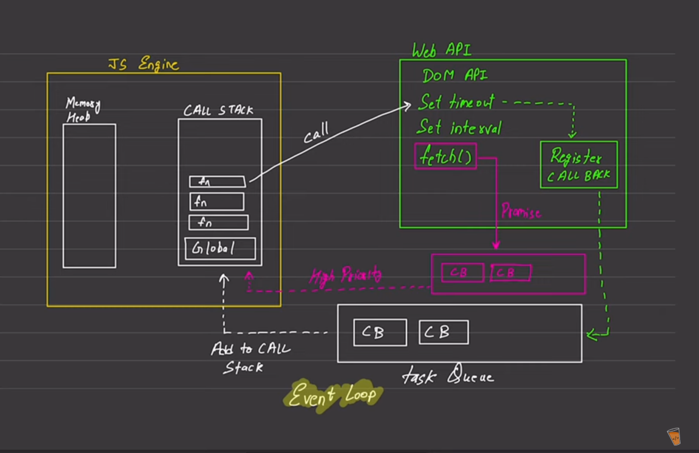

Async Code
Default Javascript
- JS is a synchronous language
- One by one code execution 
- JS is a single threaded language

-----
Execution context
- Execute one line of code at a time 
| -> console.log(1)
| -> console.log(2)
^
call stack Memory heap

- In Js each operation waits for last one to complete before executing 

-----

Blocking code                vs         Non blocking code 
- Blocks the flow of program            - Does not block execution
- Read file sync                        - Read file Async

-----

- web api provides dom  
- node does not provide dom
- Task queue is what makes JS fast by distributing and streamlining tasks
- Promises are high priority queue 
- call stack loads the functions upon global execution context 
- 