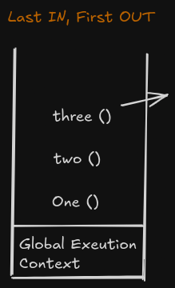

## Java script execution context

How JS runs your code file. This took place in 2 phases:

1. Memory creation phase
   - No execution took place here, just a memory is allocated
   - We can call this phase as just memory allocation phase
2. Execution phase

**When we try to run JS file first thing that happens is Global EC**

This keyword is used to refer to this GLOBAL EC (this has value window context in browser).

Java script is single threaded languages. Everything is a process in JS.

EC Types

1. Global EC
2. Functional EC
3. Eval EC

---

**Example code**

```JS
let val1 = 10
let val2 = 5

function addNum(num1, num2){
    let total = num1+num2
    return total
}
let result1 = addNum(val1, val1)
let result2 = addNum(10, 2)
```

---

**Steps to run a JS code**

1. Global Execution context :  happens first and this is allocated to it.

2. Memory creation phase : all the variables are gathered here and assigned a value as undefined.
   - for e.g. 
   - val1 - undefined, 
   - val2 - undefined, 
   - addNum - function definition, 
   - result1 - undefined, 
   - result2 - undefined,

3. Execution phase : 
   - val1 <- 10, 
   - val2 <- 5,
   - For addNum ->  creates a new executional context, Js will form a new variable environment and execution thread
   This acts as a sandbox and memory phase and execution phase will again take place 

| For new sandbox, every function, new memory phase and execution phase will run and will be deleted after its use is completed.  

   I. Memory phase
   - val1 -> undefined 
   - val2 -> undefined 
   - total -> undefined 

   II. Execution phase : All the procession will take place here like math calculation


   num1 -> 10 (which is val1)
   num2 -> 5 (which is val2)
   total -> 15 (we return this value to our Global exectional context)


ALL OF THE ABOVE WILL REPEAT FOR 2nd function and 12 will be returned.


```
Call stack
```


